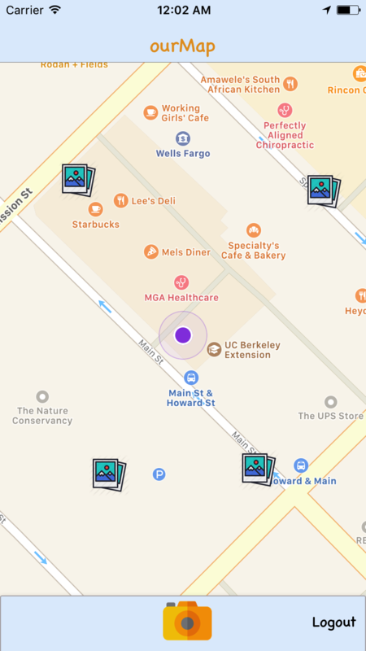
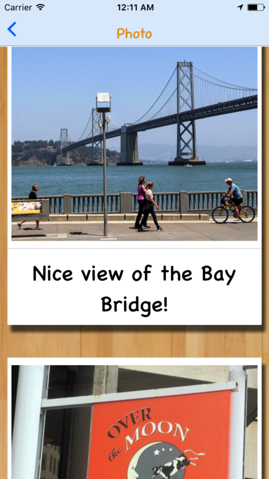

# ourMap

[Demo Page][demopage]

[demopage]: https://bhill010.github.io/ourMapDemo/

ourMap aims to connect users with their environment in their current location. Users are able to upload and drop photos in their current location for other users to see when they are in the area.

This mobile application was built with the following technologies:

- React Native (for mobile apps framework)
- Redux (for routing and authentication)
- Xcode(for mobile app development)
- Firebase (for storing geolocation and urls of photos)
- Cloudinary (for photo storage)

## Features and Implementation

### Authentication with Firebase and Redux

The ourMap application uses Firebase with Redux for user authentication. To keep track of the user's login state, an Auth Reducer was created. The Auth Reducer keeps track of the user's email and password, as well as slices of state for errors, loading, and whether or not a user exists. Redux-thunk assisted with asynchronous calls to the Firebase database, while simpler inputs, such as the user's email and password, retrieved data directly from the login form and triggered actions that went directly to the Auth Reducer.

The Auth Reducer's slice of state can be seen below.

```javascript
const INITIAL_STATE = {
  email: '' ,
  password: '',
  user: null,
  error: '',
  loading: false
};

export default (state = INITIAL_STATE, action) => {

  switch (action.type) {
    case EMAIL_CHANGED:
      return { ...state, email: action.payload };
    case PASSWORD_CHANGED:
      return { ...state, password: action.payload };
    case LOGIN_USER:
      return { ...state, loading: true, error: '' };
    case LOGIN_USER_SUCCESS:
      return { ...state,
        ...INITIAL_STATE,
        user: action.payload
      };
    case LOGIN_USER_FAIL:
      return { ...state,
        error: "Authentication Failed.",
        password: '',
        loading: false
      };
    case LOGOUT_USER:
      return INITIAL_STATE;
    default:
      return state;
  }
};
```

### Show Locations with "Dropped" Photos

The home page displays a map with four photo images surrounding the user. Each photo image covers a specific radius positioned relative from the user: TopLeft, TopRight, BottomLeft, and BottomRight. The `onPress` on each photo image navigates the user to the photoIndex page, where users are able to view photos taken and pinned in that general area.


#### HomePage

<p align="center">
    
</p>

### PhotoIndexPage

<p align="center">
    
</p>


The `getUserLocation` retrieves the user's current location and sets their coordinate to the local state. The `setPositionMarker` randomly selects a delta in a specific range and adds it to the user's coordinate to set the photo images in their respective corners: TopLeft, TopRight, BottomLeft, and BottomRight.  

```javascript
getUserLocation() {
  this.watchId = navigator.geolocation.watchPosition (

    (position) => {
      let user = {latitude: position.coords.latitude, longitude: position.coords.longitude};
      let userRegion = {latitude: position.coords.latitude, longitude: position.coords.longitude, latitudeDelta: 0.002, longitudeDelta: 0.002};

      let markers = this.setPositionMarker(position.coords.latitude, position.coords.longitude);

      this.setState({ userCoordinates: user});
      this.setState({ region: userRegion });
      this.setState({ markers: markers });
    },
    { enableHighAccuracy: false, timeout: 0, maximumAge: Infinity, distanceFilter: .001 },
  );
}

setPositionMarker(lat, long){
  let markers = [];

  let deltas = [
    [this.randomCoordinates(.0003, .0008), this.randomCoordinates(.0002, .0009), 'TopRight'],
    [this.randomCoordinates(-.0003, -.0008), this.randomCoordinates(-.0002, -.0009),'BottomLeft'],
    [this.randomCoordinates(.0003, .0008), this.randomCoordinates(-.0002, -.0009), 'TopLeft'],
    [this.randomCoordinates(-.0003, -.0008), this.randomCoordinates(.0002, .0009), 'BottomRight']
  ];

  deltas.forEach((delta) => {
    markers.push({coordinate: {latitude: lat + delta[0], longitude: long + delta[1]}, title: delta[2]});
  });

  return markers;
}
```


### Ability to Capture and Share Photos

From the Map page, users are able to go to the Camera view and take a picture from their phone. After taking a picture, they can leave a short comment with the photo for other users to see. Upon confirmation of their submission, the `watchId` responsible for locating the user's position while using the app (`navigator.geolocation.watchPosition`) is cleared so that we can get the user's position when their submission is confirmed. The user's current coordinates, the user's comment on the photo, and the photo's URL from Cloudinary are then sent to our Firebase realtime database for storage. The user is then taken back to the Map page, and the page is refreshed so that the app can continue to track the user's location.

```javascript
handleSubmit(){
  navigator.geolocation.clearWatch(this.props.watchId);
    navigator.geolocation.getCurrentPosition (
	  (position) => {
		let latitude = position.coords.latitude;
		let longitude = position.coords.longitude;
		let coordinates = {latitude, longitude};
		Database.setPhotoInformation(this.state.photoUrl, latitude, longitude, this.state.comment);
	  }
    );
  Actions.pop({popNum: 2, refresh: {}});
}
```

## Future Direction

### User Profile
Users will have their own profile page where they can upload and change their profile picture, as well as view the photos and locations of the photos they have taken.

### Ability to Add Comments to Other Photos
Users will be able to interact with other users through leaving their own comments on photos that other users have dropped on the map.

### Video capabilities
Users will be able to upload videos to the map, in addition to photos.
